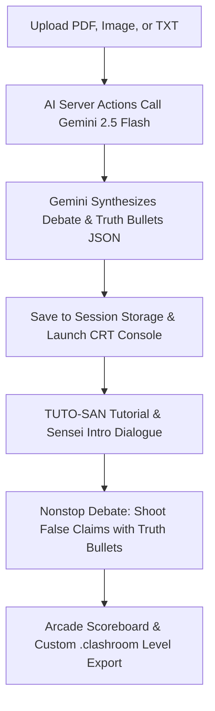

# Clashroom — AI Class Trial Debate Game

[](#visual-design)
[](https://github.com/jdjossou/mpchacks2026)
[](#ai--parsing-engine)

> **"FEED ME FILES! I consume knowledge and spit out gaming!"**  
> — TUTO-SAN, *Clashroom Mascot*

---

## Project Overview

Clashroom is an interactive, gamified study platform that dynamically transforms raw study notes, lecture PDFs, homework screenshots, and text files into an engaging debate-style mini-game. Powered by Next.js and Google Gemini 2.5 Flash, Clashroom parses uploaded files into custom debate scenarios and truth bullets, rendering them inside a fully custom-built retro CRT terminal bezel following the nostalgic Frutiger Aero design aesthetic.

---

## The Core Gameplay Loop



1. **Upload your Notes**: Drag-and-drop any PDF, image (PNG, JPG, WEBP), or TXT file under 15MB.
2. **AI Synthesis**: Google Gemini translates your raw content into a custom structured debate game (a topic, introductions, correct claims, false claims, and matching truth bullets with explanations).
3. **Tutorial & Dialogue**: Read through TUTO-SAN's interactive typewriter instructions and Professor Vale's class introduction.
4. **Play the Class Trial**: Statements float across your retro screen. Select a Truth Bullet and click a false statement to fire. Wrong hits subtract 10 seconds from your clock!
5. **Close the Case**: Finish within 2 minutes to calculate your high score, receive an arcade letter grade (S, A, B, C, D), and export your level to a .clashroom file to share with classmates!

---

## Visual & Sensory Experience

### The Frutiger Aero Landing Page
The `/upload` portal is designed as a tribute to the late-2000s Web 2.0 aesthetics:
* **Glossy Aqua Panels & Bubbles**: Semi-transparent, blur-morphic glassmorphism panels created using [GlassPanel.tsx](src/components/ui/GlassPanel.tsx).
* **Dynamic Interactive Mascot**: Mizue Sensei and TUTO-SAN greet you with playful dialogue and cycle through speech bubble taglines.
* **Liquid Gradients & Hover Scales**: Elements drift, float, and swell organically upon user interaction.

### The CRT Monitor Bezel
The `/game` screen is encased in a premium retro CRT Monitor frame built entirely in CSS inside [ComputerFrame.tsx](src/components/game/ComputerFrame.tsx):
* **Rounded Glass Corners**: Clips rendering backgrounds to follow the glass tube geometry.
* **Overlay Vignettes & Scanlines**: A blinking orange/green power LED, glass glares, dark vignettes, and scanlines that flicker subtly to make the monitor feel alive.
* **3D Plastic Housing**: Recreates the beige, heavy plastic chassis of retro monitors.

### Interactive Audio & Mute Store
No arcade game is complete without immersive sound. Clashroom runs an SSR-safe audio pipeline:
* **Persistent Settings**: Global state managed by [audioSettings.ts](src/lib/audioSettings.ts) saves your preferences to browser storage and supports mute subscriptions.
* **Fluid Soundtrack Loops**: Managed by [music.ts](src/lib/music.ts), featuring custom tracks for the landing page, tutorial, and gameplay.
* **Overlapping SFX**: Powered by [sound.ts](src/lib/sound.ts) to handle overlapping audio nodes for selection clicks, bullet shooting, wrong penalties, and win fanfares.

---

## Project Architecture

```
mpchacks2026/
├── public/                       # Static assets (Sounds, background music, images)
│   ├── backgrounds/              # Aesthetic background wallpapers
│   ├── characters/               # Character sprites (Sensei, Mika, Ren, TUTO-SAN)
│   ├── effects/                  # Sound effect .wav files (menu clicks, shoots, wins)
│   └── music/                    # Looping .mp3 background soundtracks
├── src/
│   ├── app/                      # Next.js App Router Page Mappings
│   │   ├── favicon.ico           # Website favicon icon
│   │   ├── layout.tsx            # Global metadata, layout, and floating MuteButton
│   │   ├── game/
│   │   │   └── page.tsx          # Server Component housing ComputerFrame & Session Game
│   │   └── upload/
│   │       └── page.tsx          # Aero landing portal with drag-n-drop file uploaders
│   ├── components/               # React UI & Engine Components
│   │   ├── MuteButton.tsx        # Floating Glassmorphic global Mute button
│   │   ├── game/                 # Sub-components powering the Class Trial Engine
│   │   │   ├── BulletCard.tsx    # Drag-and-drop interactive Truth Bullets
│   │   │   ├── BulletInventory.tsx # Dock mapping and shooting Bullets at statements
│   │   │   ├── CharacterStage.tsx # Character sprite rendering (breathing/speaking states)
│   │   │   ├── ClassTrial.tsx    # Main Client Orchestrator / state subscriber
│   │   │   ├── ComputerFrame.tsx # Beige CRT physical bezel & vignette
│   │   │   ├── DialogueBox.tsx   # Interactive dialogue window with typewriter logic
│   │   │   ├── FloatingStatement.tsx # Danganronpa-styled floating statement card
│   │   │   ├── GameFromSession.tsx # Dynamically extracts session levels or feeds sample
│   │   │   ├── ResultsScreen.tsx # High-fidelity scoreboard & S-Rank grader
│   │   │   ├── TrialTimer.tsx    # Solving countdown timer
│   │   │   ├── classTrialReducer.ts # State reducer for 5-phase FSM
│   │   │   └── useTypewriter.ts  # Custom typewriter text scrolling hook
│   │   └── ui/
│   │       └── GlassPanel.tsx    # Reusable glossy gel card panel
│   ├── lib/                      # Core Logic & Utilities
│   │   ├── audioSettings.ts      # Persistent Client-side local storage mute store
│   │   ├── music.ts              # Loop-based Singleton BG music player
│   │   ├── sound.ts              # Custom sound node cloning pool
│   │   ├── game/                 # Game Engine Calculations & Schemas
│   │   │   ├── gameTypes.ts      # TypeScript interfaces for Debate parameters
│   │   │   ├── generatedGame.ts  # Mapper validating raw JSON data into GameConfig
│   │   │   ├── sampleGame.ts     # Default "Virtual Memory" debate round
│   │   │   ├── scoring.ts        # Point math (base, hits, wrong penalty, time bonuses)
│   │   │   ├── selectors.ts      # Puzzle evaluation helper functions
│   │   │   └── tutorialScript.ts # Interactive text scripting for TUTO-SAN
│   │   └── parsing/              # Gemini Server-side Actions
│   │       ├── actions.ts        # Server Actions communicating with Gemini API
│   │       ├── prompt.txt        # Detailed PDF parsing instructions for Gemini JSON
│   │       ├── image_prompt.txt  # Structured vision instructions for Image parsing
│   │       └── loading_messages.txt # Frutiger Aero loading status scripts
│   └── styles/
│       └── globals.css           # 21KB Custom CSS (CRT framing, glass panel glares, animations)
├── .env.local                    # Local environment variables (Gemini API Key)
├── package.json                  # Dependencies configuration
└── tsconfig.json                 # TypeScript compiler configuration
```

---

## Detailed File Directory & Links

Below is a detailed breakdown of the files that power Clashroom. Click any path to view its source:

### AI Parsing & Document Synthesis
* [actions.ts](src/lib/parsing/actions.ts): Next.js Server Actions calling Gemini 2.5 Flash to dynamically transform raw PDFs, homework images, or txt uploads into structured JSON debate templates.
* [prompt.txt](src/lib/parsing/prompt.txt): System prompt used for instructing the AI model on how to convert raw text logs into a structured 11-field debate level template.
* [image_prompt.txt](src/lib/parsing/image_prompt.txt): System prompt optimized for Vision analysis when processing screenshots or images.
* [generatedGame.ts](src/lib/game/generatedGame.ts): Schema validator that consumes the raw JSON from the server and safely structures a standard [GameConfig](src/lib/game/gameTypes.ts) layout.

### The Game Engine
* [ClassTrial.tsx](src/components/game/ClassTrial.tsx): The main `'use client'` conductor. Subscribes to the state reducer, coordinates clock tickers, triggers active sound elements, and switches between layout screens.
* [classTrialReducer.ts](src/components/game/classTrialReducer.ts): A robust finite state machine running 5 distinct phases:
  `tutorial -> intro -> solving -> winConclusion -> results`
* [scoring.ts](src/lib/game/scoring.ts): Math calculators for arcade high-scores. Correct hits add +500, mistakes subtract -150, base wins award +1000, and each remaining second adds +20 points!

### Immersive CRT & UI Components
* [ComputerFrame.tsx](src/components/game/ComputerFrame.tsx): CSS retro wrapper implementing CRT scanlines, glass curvatures, glare, heavy vignette shadow, and close button link.
* [FloatingStatement.tsx](src/components/game/FloatingStatement.tsx): Renders custom animated text boxes flying in random vectors across the student's podium. Includes targetable glows and CORRECTED stamp animations.
* [DialogueBox.tsx](src/components/game/DialogueBox.tsx): Retro speech bubble featuring typewriter scroll speeds, speech bubble arrow indicators, and skip-tutorial button overlays.
* [ResultsScreen.tsx](src/components/game/ResultsScreen.tsx): Custom S-Rank grader, high-score countups, leaderboard line rows, and dynamic custom levels download manager (.clashroom file).
* [globals.css](src/styles/globals.css): Full CSS system detailing CRT scanline filters, gel buttons, glassy reflections, and background bubbles animations.

---

## Tech Stack & Libraries

Clashroom leverages a premium, bleeding-edge modern stack to optimize performance and styling:

| Technology | Scope | Version | Utility |
| :--- | :--- | :--- | :--- |
| **Next.js** | Core Framework | `16.2.6` | App Router routing system, fast server action rendering pipelines. |
| **React** | Runtime | `19.2.4` | Hook-based engine rendering (`useReducer`, `useSyncExternalStore`). |
| **Tailwind CSS** | Styling | `v4.0.0` | Inline utility classes utilizing v4 `@theme` design tokens. |
| **Framer Motion** | Animations | `12.40.0` | Powers floating statements, mascot dialogue, and CRT transitions. |
| **Lucide React** | Icons | `1.17.0` | Lightweight high-quality SVG vector icons library. |
| **pdf-parse** | PDF Engine | `2.4.5` | Server-side text crawler converting PDFs into string dumps. |
| **TypeScript** | Compiler | `v5` | Strict static type definitions enforcing flawless data structures. |
| **Google Gemini API** | AI Model | `2.5-flash` | Server action pipelines generating JSON structures via Vision & Text APIs. |

---

## Running Locally

### 1. Prerequisite Installations
Ensure you have [Node.js](https://nodejs.org) installed on your Windows machine.

### 2. Install Project Dependencies
Clone the repository, navigate to the directory, and run the dependency installer:
```bash
npm install
```

### 3. Setup Gemini API Key
Create a `.env.local` file in your root project directory:
```bash
# .env.local
GEMINI_API_KEY=your_google_gemini_api_key_here
```

> [!NOTE]
> You can acquire a free Google Gemini developer API key directly from [Google AI Studio](https://aistudio.google.com/).

### 4. Start the Dev Server
Launch the development server:
```bash
npm run dev
```

### 5. Access the Web App
Open your web browser and navigate to:
* **Upload Hub**: [http://localhost:3000](http://localhost:3000) (Redirects straight to `/upload`)
* **Interactive Sandbox Game**: [http://localhost:3000/game](http://localhost:3000/game) (Initiates default *Virtual Memory Class Trial* demo)

---

## Gameplay Overview

### The Problem
Traditional study materials are passive. Staring at dense text books or slideshows leads to poor recall and disengagement.

### The Solution
Clashroom turns learning into a high-stakes investigation. By translating your files into a classic arcade debate game, it forces active recall and critical evaluation of facts in real-time.

* **The Debate Stage**: Classmates float on screen, asserting statements generated directly from your source notes.
* **The Truth Bullets**: You are handed bullets containing raw, factual counter-arguments.
* **The Interrogation**: You must read the active statement, check your bullet inventory, drag the correct fact-check bullet, and fire it directly at the lie. Correcting the lie rotates the statement out, while getting it wrong or missing penalizes your time by 10 seconds.
* **Letter Grades and Sharing**: Completing the case grades your performance from S to D. Once finished, you can save your customized study session as a portable .clashroom file and share it with friends to test their understanding.

> [!TIP]
> When you win or finish a level, click **Save Level** to export your custom parsed study notes as a `.clashroom` file. You can load these levels again or share them with friends to compete for the ultimate high score!


